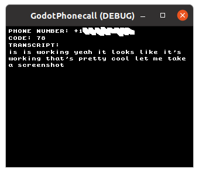

# GodotPhonecall

This is an example "game" which connects to a `game-twilio-deepgram-distributor` server:

https://github.com/nikolawhallon/game-twilio-deepgram-distributor

To test, grab and run the `game-twilio-deepgram-distributor` server (check its README for instructions),
then open this project with Godot 3.5.1 and run it.

